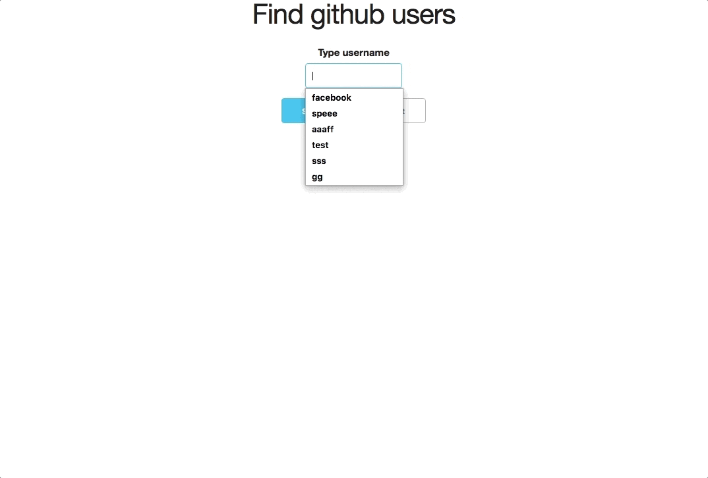

# javascript app

## webpackセッティング
```js
module.exports = {
  mode: "development",
  devServer: {
    contentBase: "./dist",
    //デフォルトだと8080だけど、ウィルスソフトとか使っている場合見れない場合がある、その場合はここに記載して変更する
    port: 9898,
  }
```

## bablercのセッティング
- bable-loaderでこける場合は、verに注意！８・３０日時点でver8に上がっているので、bableをそのままnpmした最新版だと動かないかも
```js
  module: {
    rules: [
      {
        test: /\.js$/,
        // "babel-loader": "^7.1.4"だとこれでいける
        use: [{ loader: "babel-loader" }],
        exclude: /node_modules/
      }
    ]
  }
```


## 完成図
